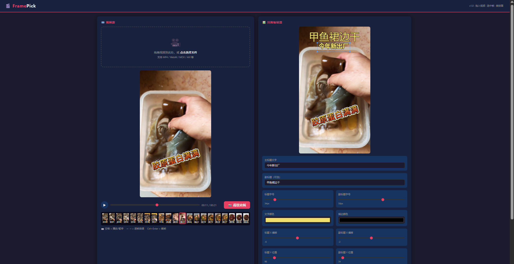

# FramePick 🎬✂️

**Drag & drop a video → Capture any frame → Add text overlays → Export your thumbnail**

A zero-dependency, single-file HTML tool for capturing video frames and designing custom thumbnails. Everything runs in your browser — no uploads, no servers, no AI.



---

## ✨ Features

- **🎯 Frame Capture** — Click any point on the timeline to grab the perfect frame; fine-tune with precision slider
- **🎞️ Filmstrip Timeline** — Full-progress thumbnail preview loads on launch, instantly see what's at every moment
- **✏️ On-Canvas Text Editing** — Double-click text to edit content directly on the canvas, just like Photoshop/Canva
- **↕️ Drag & Resize** — Drag text to reposition (X/Y both axes); drag corner handles to scale font size
- **🎨 Full Style Control** — Font size, color, stroke (width + color), alignment (left/center/right), independent X/Y offset
- **📐 Aspect Ratio Presets** — Optimized for short-form video platforms:
  - **9:16** — TikTok, YouTube Shorts, Instagram Reels, Kuaishou
  - **16:9** — YouTube, Bilibili, standard landscape
  - **1:1** — Instagram feed, social media
  - **4:3, 21:9** — Classic & cinematic
  - **Original** — Auto-detect video aspect ratio
- **📥 One-Click Export** — Save as PNG directly to your device

## 🚀 How to Use (Step by Step)

### 📂 Step 1: Open the Tool

You have **two easy ways** to open `framepick.html`:

**Method A — Python (easiest, zero install)**
If you already have Python installed, just double-click `framepick.html` — it opens directly in your browser! ✅

**Method B — Python HTTP server (if the video doesn't load)**
Some browsers block local video files. In that case:
```bash
# Open a terminal / command prompt and type:
python -m http.server 8080
```
Then open your browser and go to: **http://localhost:8080/framepick.html**

> 🖥️ **No Python?** Use VS Code with Live Server extension, or any static server.

---

### 🎬 Step 2: Load Your Video

- **Drag & drop** any video file (MP4, MOV, etc.) from your computer directly onto the page
- The video starts playing immediately, and the **filmstrip timeline** (thumbnail previews) loads automatically at the bottom
- 🎯 **Tip:** You can also click the "Choose Video" / file picker button to browse for a file

---

### 🖼️ Step 3: Capture a Frame

1. **Click anywhere on the timeline** (the progress bar with thumbnails) to seek to the moment you want
2. Click the **🎯 Capture Frame** button — the current frame is now locked into the editor panel on the right
3. Use the **fine-tune slider** (below the video) to adjust the time position by tiny amounts

---

### ✏️ Step 4: Add & Edit Text

Once a frame is captured, you can add text overlays:

**Add text:**
- Type in the **Title** and **Subtitle** input fields at the bottom
- The text appears instantly on the captured frame

**Edit text on the canvas (no typing in panels):**
- **Double-click** the text directly on the canvas → an edit box appears
- Type your new text → press **Enter** to confirm, or **Esc** to cancel

**Move text around:**
- **Click** the text on the canvas → a **blue selection box** with corner handles appears
- **Drag the text** itself (✋ cursor) to move it anywhere — up/down, left/right

**Resize text:**
- **Drag any corner handle** (the small white squares) up/down to make the text bigger or smaller
- Or use the **font size sliders** in the control panel below

**Style options (in the control panel):**
| Control | What it does |
|---------|-------------|
| Font Size | Bigger / smaller text |
| X Offset | Move text left or right |
| Y Offset | Move text up or down |
| Alignment | Left / Center / Right |
| Text Color | Pick any color |
| Stroke | Outline width and color (great for readability) |

---

### 📐 Step 5: Choose Your Output Size

Use the **Aspect Ratio** buttons to match your target platform:

| Button | Best for |
|--------|----------|
| **9:16** | **TikTok, YouTube Shorts, Instagram Reels** (vertical) |
| **16:9** | YouTube, Bilibili (landscape) |
| **1:1** | Instagram feed, social media |
| **4:3** | Classic video format |
| **21:9** | Cinematic / ultrawide |
| **Original** | Auto-detect from your video |

The editor preview immediately updates to the selected ratio.

---

### 💾 Step 6: Export

- **Right-click** on the edited image → **Save Image As** → choose a location on your computer
- Or use the **Export PNG** button if available

✅ **Done!** Your thumbnail is ready to upload to TikTok, YouTube, Instagram, or anywhere else.

## 🖱️ Quick Reference

| Action | Result |
|--------|--------|
| Drag video onto page | Load video |
| Click filmstrip / timeline | Seek to time position |
| Capture Frame | Lock current frame to editor |
| Click text on canvas | Select (blue outline + corner handles) |
| Drag selected text | Move X/Y position |
| Drag corner handle | Resize font size |
| Double-click text | Inline edit text content |
| Right-click → Save As | Export PNG |

## 🛠️ Tech Stack

Pure **HTML5 Canvas + Vanilla JavaScript** — zero dependencies, single HTML file, works entirely offline.

---

Made with ❤️ by [JuBenXia](https://github.com/JuBenXia/FramePick)
